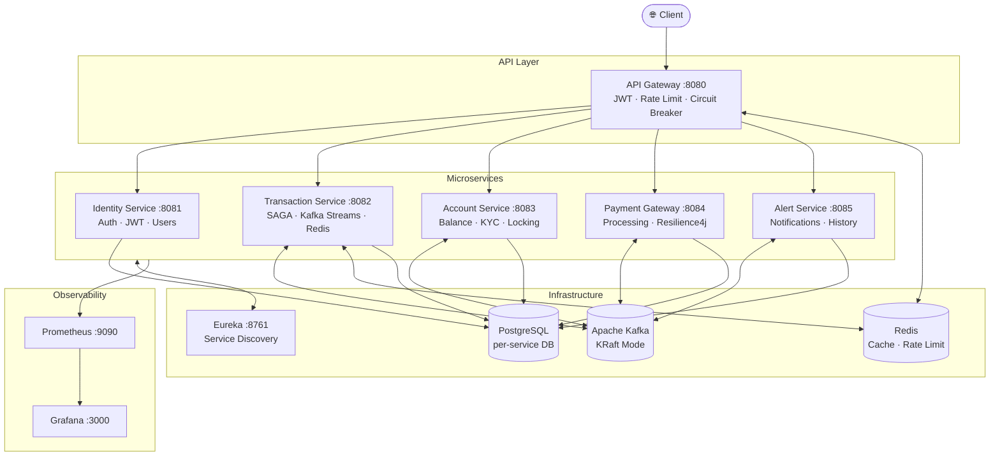
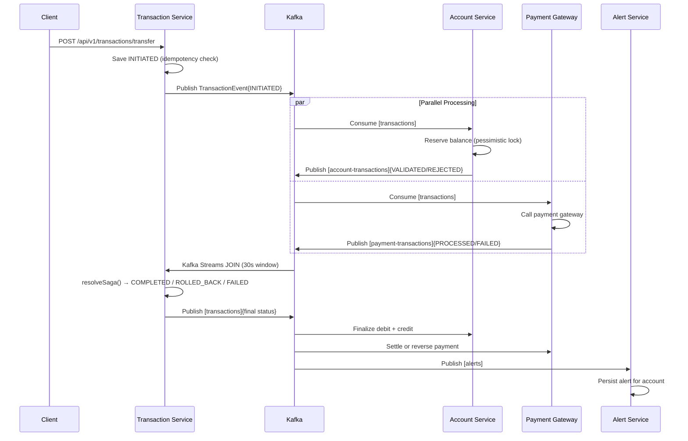
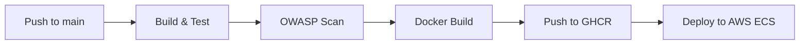

<div align="center">

# Kafsys

### Cloud-Native Banking Transaction Processing Platform

*Enterprise-grade event-driven microservices for distributed banking operations*

[](https://github.com/rubrx/Kafsys/actions/workflows/kafsys-ci.yml)
[](https://openjdk.org/projects/jdk/21/)
[](https://spring.io/projects/spring-boot)
[](https://kafka.apache.org/)
[](https://www.postgresql.org/)
[](https://redis.io/)
[](LICENSE.md)

</div>

---

## Overview

Kafsys is a production-grade backend platform simulating a **real-world banking transaction processing system**. It implements the **SAGA pattern** using Apache Kafka Streams to coordinate distributed fund transfers across independent microservices — with JWT security, Redis caching, circuit breaking, and full observability built in.

**Key capabilities:**
- Idempotent fund transfers with distributed SAGA coordination
- Account lifecycle management with KYC verification
- Real-time transaction alerts via event-driven pipeline
- JWT authentication with role-based access control
- API Gateway with rate limiting and circuit breaker

---

## System Architecture



---

## SAGA Transaction Flow

When a fund transfer is initiated, a distributed SAGA coordinates across three services using Kafka Streams:



**SAGA resolution logic:**

| Account | Payment | Result |
|---|---|---|
| VALIDATED | PROCESSED | ✅ COMPLETED |
| REJECTED | PROCESSED | ↩️ ROLLED_BACK (source: ACCOUNT) |
| VALIDATED | FAILED | ↩️ ROLLED_BACK (source: PAYMENT) |
| REJECTED | FAILED | ❌ FAILED |

---

## Services

| Service | Port | Responsibility |
|---|---|---|
| **API Gateway** | `8080` | Routing, JWT validation, rate limiting, circuit breaker |
| **Identity Service** | `8081` | Registration, login, JWT + refresh tokens, RBAC |
| **Transaction Service** | `8082` | Transfer initiation, SAGA orchestration, idempotency |
| **Account Service** | `8083` | Account CRUD, balance management, KYC status |
| **Payment Gateway** | `8084` | Payment processing, external gateway, settlement |
| **Alert Service** | `8085` | Event-driven alerts, notification history |
| **Service Registry** | `8761` | Eureka service discovery |

---

## Tech Stack

| Concern | Technology |
|---|---|
| Language | Java 21 |
| Framework | Spring Boot 3.4.5 · Spring Cloud 2024.0.1 |
| Messaging | Apache Kafka 3.9 (KRaft) · Kafka Streams |
| Databases | PostgreSQL 17 (per-service) · H2 (dev) |
| Cache | Redis 7.4 |
| Security | Spring Security · JWT (jjwt 0.12.6) · BCrypt |
| API Docs | OpenAPI 3 · Swagger UI (springdoc 2.8) |
| Resilience | Resilience4j circuit breaker |
| DB Migrations | Flyway 10 |
| Observability | Micrometer · Prometheus · Grafana |
| Build | Maven 3.9 · JIB |
| CI/CD | GitHub Actions → AWS ECS |
| Containers | Docker · Docker Compose |

---

## Getting Started

### Prerequisites

| Tool | Version |
|---|---|
| Java | 21+ |
| Maven | 3.9+ |
| Docker | Latest |

### Option 1 — Local (H2, fastest)

**Start Kafka + Redis**
```bash
# Kafka (KRaft — no Zookeeper needed)
docker run -d --name kafsys-kafka -p 9092:9092 \
  -e KAFKA_NODE_ID=1 \
  -e KAFKA_PROCESS_ROLES=broker,controller \
  -e KAFKA_LISTENERS=PLAINTEXT://0.0.0.0:9092,CONTROLLER://0.0.0.0:9093 \
  -e KAFKA_ADVERTISED_LISTENERS=PLAINTEXT://localhost:9092 \
  -e KAFKA_CONTROLLER_QUORUM_VOTERS=1@localhost:9093 \
  -e KAFKA_CONTROLLER_LISTENER_NAMES=CONTROLLER \
  -e KAFKA_LISTENER_SECURITY_PROTOCOL_MAP=PLAINTEXT:PLAINTEXT,CONTROLLER:PLAINTEXT \
  -e CLUSTER_ID=kafsys-local \
  apache/kafka:3.9.0

docker run -d --name kafsys-redis -p 6379:6379 redis:7.4-alpine
```

**Build and run**
```bash
# Build everything
mvn clean install -DskipTests

# Start in order (each in a new terminal)
java -jar service-registry/target/service-registry-1.0.0.jar       # wait for Eureka
java -jar identity-service/target/identity-service-1.0.0.jar
java -jar transaction-service/target/transaction-service-1.0.0.jar
java -jar account-service/target/account-service-1.0.0.jar
java -jar payment-gateway-service/target/payment-gateway-service-1.0.0.jar
java -jar alert-service/target/alert-service-1.0.0.jar
java -jar api-gateway/target/api-gateway-1.0.0.jar                 # start last
```

### Option 2 — Docker Compose (full stack with PostgreSQL)

```bash
mvn clean package -DskipTests
docker compose up --build
```

> Wait ~60 seconds for all services to register with Eureka.

---

## API Walkthrough

### 1. Authenticate

```bash
# Login with a seeded account
curl -s -X POST http://localhost:8080/api/v1/auth/login \
  -H "Content-Type: application/json" \
  -d '{"username": "admin", "password": "Admin@Kafsys1"}' | jq .
```

```json
{
  "success": true,
  "data": {
    "accessToken": "eyJhbGci...",
    "refreshToken": "a1b2c3...",
    "expiresIn": 900,
    "role": "ROLE_ADMIN"
  }
}
```

```bash
# Store the token
TOKEN=$(curl -s -X POST http://localhost:8080/api/v1/auth/login \
  -H "Content-Type: application/json" \
  -d '{"username":"admin","password":"Admin@Kafsys1"}' | jq -r '.data.accessToken')
```

### 2. Create an Account

```bash
curl -s -X POST http://localhost:8080/api/v1/accounts \
  -H "Authorization: Bearer $TOKEN" \
  -H "Content-Type: application/json" \
  -d '{
    "ownerId": "user-001",
    "ownerName": "Alice Chen",
    "initialDeposit": 50000.00,
    "currency": "USD"
  }' | jq .
```

### 3. Initiate a Fund Transfer

```bash
curl -s -X POST http://localhost:8080/api/v1/transactions/transfer \
  -H "Authorization: Bearer $TOKEN" \
  -H "Content-Type: application/json" \
  -d '{
    "idempotencyKey": "txn-20240507-001",
    "sourceAccountId": "<source-id>",
    "destinationAccountId": "<dest-id>",
    "amount": 1500.00,
    "currency": "USD",
    "referenceNote": "Invoice #1042"
  }' | jq .
```

The transfer returns `202 Accepted` with status `INITIATED`. The SAGA runs asynchronously — poll to check completion:

```bash
curl -s http://localhost:8080/api/v1/transactions/txn-20240507-001 \
  -H "Authorization: Bearer $TOKEN" | jq '.data.status'
# → "COMPLETED"
```

### 4. Check Alerts

```bash
curl -s "http://localhost:8080/api/v1/alerts?accountId=<id>&unreadOnly=true" \
  -H "Authorization: Bearer $TOKEN" | jq .
```

---

## Seed Data

The platform loads realistic data on first startup (local/H2 mode).

**Users** — identity-service

| Username | Password | Role |
|---|---|---|
| `admin` | `Admin@Kafsys1` | ROLE_ADMIN |
| `operator` | `Operator@Kafsys1` | ROLE_OPERATOR |
| `alice.chen` | `Alice@Kafsys1` | ROLE_CUSTOMER |
| `bob.taylor` | `Bob@Kafsys1` | ROLE_CUSTOMER |
| `carol.smith` | `Carol@Kafsys1` | ROLE_CUSTOMER |

**Accounts** — account-service (all ACTIVE, KYC VERIFIED)

| Owner | Balance | Currency |
|---|---|---|
| Alice Chen | 50,000 | USD |
| Bob Taylor | 35,000 | USD |
| Carol Smith | 75,000 | USD |
| Dave Johnson | 12,000 | USD |
| Eve Martinez | 90,000 | GBP |

---

## Swagger UI

| Service | URL |
|---|---|
| Identity Service | http://localhost:8081/swagger-ui.html |
| Transaction Service | http://localhost:8082/swagger-ui.html |
| Account Service | http://localhost:8083/swagger-ui.html |
| Payment Gateway | http://localhost:8084/swagger-ui.html |
| Alert Service | http://localhost:8085/swagger-ui.html |

---

## Observability

| Tool | URL | Credentials |
|---|---|---|
| Eureka Dashboard | http://localhost:8761 | admin / kafsys-registry-secret |
| Prometheus | http://localhost:9090 | — |
| Grafana | http://localhost:3000 | admin / kafsys-grafana |

All services expose `/actuator/health` and `/actuator/prometheus`.

---

## Project Structure

```
kafsys/
├── pom.xml                          # Parent POM — Spring Boot 3.4.5
├── docker-compose.yml               # Full-stack orchestration
├── observability/
│   └── prometheus.yml
├── .github/workflows/
│   └── kafsys-ci.yml                # CI: build → test → Docker → ECS
│
├── common-domain/                   # Shared library
│   └── com/kafsys/common/
│       ├── dto/                     # ApiResponse, PagedResponse
│       ├── enums/                   # TransactionStatus, AccountStatus, KycStatus
│       ├── event/                   # TransactionEvent, AlertEvent
│       └── exception/               # KafsysException hierarchy
│
├── service-registry/                # :8761 — Eureka
├── api-gateway/                     # :8080 — Spring Cloud Gateway
├── identity-service/                # :8081 — JWT + BCrypt
├── transaction-service/             # :8082 — SAGA + Kafka Streams
├── account-service/                 # :8083 — Balance + KYC
├── payment-gateway-service/         # :8084 — Payments + Resilience4j
└── alert-service/                   # :8085 — Kafka consumer
```

---

## Design Decisions

**Kafka Streams SAGA** — Account and payment responses are joined on `transactionId` using a 30-second windowed `KStream.join()`. No centralized coordinator — the stream processor itself is the SAGA orchestrator, giving fault-tolerant stateful coordination.

**Pessimistic locking** — `AccountRepository.findByIdForUpdate()` uses `@Lock(PESSIMISTIC_WRITE)` to prevent concurrent overdraft. The `reserved_balance` column acts as a two-phase commit hold before the final debit is confirmed.

**Idempotency** — The `idempotencyKey` in a transfer request maps directly to the transaction's primary key. Re-submitting the same key returns `409 Conflict` without reprocessing — safe under network retries.

**JWT header forwarding** — The API Gateway validates JWTs and injects `X-Auth-UserId` and `X-Auth-Roles` into upstream requests. Downstream services trust these headers, avoiding redundant token validation on every hop.

**Database-per-service** — Each microservice owns its PostgreSQL schema. Cross-service data flows exclusively through Kafka events, enforcing hard bounded-context isolation.

---

## CI/CD Pipeline



Secrets required: `AWS_ACCESS_KEY_ID`, `AWS_SECRET_ACCESS_KEY`, `AWS_REGION`

---

## License

[MIT](LICENSE.md)
